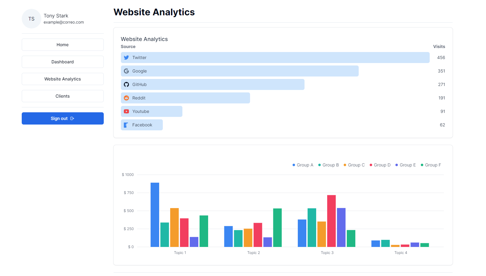

# Technical Test: React Developer with Next.js and TailwindCSS 

## Table of Contents

- [Technical Test: React Developer with Next.js and TailwindCSS](#technical-test-react-developer-with-nextjs-and-tailwindcss)
  - [Table of Contents](#table-of-contents)
  - [Description](#description)
  - [Screenshots](#screenshots)
  - [Requirements](#requirements)
  - [Installation / How to run](#installation--how-to-run)
  - [Environment Variables](#environment-variables)
  - [Pages description](#pages-description)
  - [Project Structure](#project-structure)
  - [Todo List](#todo-list)
    - [Task 1: Advanced Next.js Architecture (30 points)](#task-1-advanced-nextjs-architecture-30-points)
    - [Task 2: Advanced Component Development (35 points)](#task-2-advanced-component-development-35-points)
    - [Task 3: Large Dataset Handling (25 points)](#task-3-large-dataset-handling-25-points)
    - [Task 4: Performance Optimization and Server-Side Rendering (25 points)](#task-4-performance-optimization-and-server-side-rendering-25-points)
    - [Task 5: Advanced Features (30 points)](#task-5-advanced-features-30-points)
    - [Task 6: Testing and Documentation (15 points)](#task-6-testing-and-documentation-15-points)
  - [Deployment](#deployment)
  - [Stack, Libraries, and Tools](#stack-libraries-and-tools)
  - [Conclusions](#conclusions)
  - [Contribute](#contribute)
  - [Author of the project](#author-of-the-project)
  - [License](#license)

## Description

This project is a technical test for a React Developer position. It is a dashboard application built with Next.js and TailwindCSS. The application is a micro-frontend architecture with Module Federation. The application is a dashboard that displays data from a mock API. The dashboard is a dynamic dashboard with charts and graphs.

## Screenshots





## Requirements

- Node: v20.10.0
- Npm: v10.3.0
- Module-federation/nextjs-mf: v6.7.1
- Next: v13.4.7
- Tailwindcss: v3.0.23

## Installation / How to run

It's a demo, so everything is in the same repository. However, it's a good practice to have each micro-frontend in a different repository and deploy them separately, using run-time integration, for example.

So to install it you just need to clone the repository and run the following command:

Install dependencies

```bash
npm install
```

To run the samples in development mode, run the following command:

```bash
npm run dev
```

To run the samples in production mode, first build the samples using the following command:

```bash
npm run build
```

Then, run the following command to serve the samples:

```bash
npm run start
```

## Environment Variables

The environment variables are located in the `.env` file. The following environment variables are required:

- `GITHUB_ID`: GitHub OAuth App Client ID.
- `GITHUB_SECRET`: GitHub OAuth App Client Secret.
- `NEXTAUTH_URL`: The URL of the NextAuth.js server.
- `NEXTAUTH_SECRET`: A secret used to encrypt session cookies.
- `ANALYTICS_REMOTE_URL`: The URL of the analytics micro-frontend.

## Pages description

- `/`: The homepage of the application with login and signup buttons.
- `/404`: The 404 page of the application.
- `/dashboard`: The dashboard page of the application. (Protected)
- `/dashboard/website-analytics`: The website analytics page of the application. (Protected)
- `/dashboard/clients`: The clients page of the application. (Protected)

## Project Structure 

```bash
react-nextjs-tailwindcss-microfrontends/
│
├── apps/
│   │
│   ├── remote/
│   │   ├── public/
│   │   ├── pages/
│   │   ├── lib/
│   │   ├── components/
│   │   ├── styles/
│   │   ├── ...
│   │   ├── tailwind.config.js
│   │   ├── next.config.js
│   │   └── tsconfig.json
│   │
│   └── host/
│       ├── cypress/
│       ├── public/
│       └── src/
│            ├── assets/
│            ├── components/
│            ├── pages/
│            ├── lib/
│            ├── styles/
│            ├── ...
│            ├── tailwind.config.js
│            ├── next.config.js
│            └── tsconfig.json    
└── docs/
```

## Todo List

### Task 1: Advanced Next.js Architecture (30 points)
- [X] Implement a micro-frontends architecture using Module Federation.
- [X] Integrate an external analytics module as a federated module.
- [X] Secure routes using NextAuth.js for authentication.

### Task 2: Advanced Component Development (35 points)
Animated UI Components (20 points)
- [X] Develop a dynamic dashboard component with charts and graphs to visualize data.
- [X] Use a data visualization library (e.g., D3.js, Chart.js) for rendering charts.
- [X] Implement smooth transitions and interactions within the dashboard.

Custom Hook (15 points)

- [X] Create a custom hook for handling complex state management scenarios (e.g., data fetching, caching, and real-time updates).
- [X] Use the hook in at least two different components to showcase its versatility.

### Task 3: Large Dataset Handling (25 points)
- [X] Fetch and display a large dataset (e.g., 10,000 records) efficiently on the homepage.
- [X] Implement virtualization or pagination to handle the large dataset without compromising performance.
- [X] Optimize the data fetching mechanism for minimal server load.

### Task 4: Performance Optimization and Server-Side Rendering (25 points)
- [X] Optimize the application for mobile performance using Google Lighthouse metrics.
- [X] Implement server-side rendering (SSR) for critical pages to improve the initial loading time.
- [X] Ensure efficient resource loading using strategies like pre-fetching or pre-loading.

### Task 5: Advanced Features (30 points)
Real-time Collaboration (15 points)
- [ ] Implement real-time collaborative editing for a shared document.
- [ ] Utilize a technology like Firebase Realtime Database or Socket.io for real-time updates.
  
Advanced Styling (15 points)

- [X] Implement a theming system with multiple theme options.
- [X] Integrate Tailwind CSS JIT for optimizing the styling workflow and reducing the final bundle size.

### Task 6: Testing and Documentation (15 points)
- [X] Write end-to-end tests using Cypress for critical user flows.
- [X] Provide comprehensive documentation covering architecture, data models, and instructions for development and deployment.

Submission Guidelines:
- [X] Share the link to the Git repository containing your code.
- [X] Provide a detailed README with instructions, architecture overview, and any additional information.
- [X] Ensure that your application is deployed, and share the deployment link (e.g., Netlify, Vercel).

## Deployment

- The host/shell application [here](https://nextjs-typescript-module-federation-host.vercel.app/).
- The remote application [here](https://nextjs-typescript-module-federation-remote.vercel.app/).

## Stack, Libraries, and Tools

This project uses the following stack:

- Library: [React](https://reactjs.org/)
- Framework: [Next.js](https://nextjs.org/)
- Architecture: [Micro-Frontends](https://micro-frontends.org/)
- Concept: [Module Federation](https://webpack.js.org/concepts/module-federation/)
- Language: [TypeScript](https://www.typescriptlang.org/)
- Auth: [NextAuth.js](https://next-auth.js.org/)
- Deployment: [Vercel](https://vercel.com/)
- Styling: [TailwindCSS](https://tailwindcss.com/)
- Components: [MUI](https://mui.com/) and [shadcn/ui](https://ui.shadcn/ui.com/)
- Linting: [ESLint](https://eslint.org/)
- Formatting: [Prettier](https://prettier.io/)
- Version Control: [Git](https://git-scm.com/)
- Repository Hosting: [GitHub](https://github.com/)
- Data fetching: [SWR](https://swr.vercel.app/)
- Testing: [Cypress](https://www.cypress.io/)

## Conclusions

- **Limitation in Next.js App Router:**

The current version of Next.js App Router does not support Module Federation.
You need to opt for an older version of Next.js and use a plugin designed to integrate Module Federation with Next.js.

- **Webpack configuration:**

Configuring Webpack to expose and define remotes is relatively simple.
It is recommended to perform build tests to identify possible incompatibilities with Next.js or other component libraries or Hooks.

- **Development with Tailwind CSS:**

Tailwind CSS makes development easier by providing a smooth experience.
When exposing remotes for use in the host/shell application, you face a challenge: class references in the build can break. Two possible solutions are:
Use safelist to maintain the necessary classes. Import the Tailwind CSS module into each component file to generate the necessary classes and allow the host/shell to reference them correctly.

- **Integration Experience:**

The combination of Next.js, Module Federation and Tailwind CSS offers an interesting experience during development.
Despite the attractive integration, it is suggested to consider other stacks for projects in production.

- **Recommendation from the Creator of Module Federation:**

In conversation with [Zack Jackson](https://github.com/ScriptedAlchemy), creator of Module Federation, he mentions that Next.js presents exceptional difficulties in terms of maintenance due to problems with Vercel in relation to MF.

The recommendation to carefully consider these difficulties provides perspective on the potential limitations in choosing this technology mix for projects beyond development.


## Contribute

If you want to contribute to this project, you can do so by following these steps:

1. Fork the project.
2. Create a new branch (`git checkout -b feature/feature-name`).
3. Commit your changes (`git commit -m 'feat: add new feature'`).
4. Push the branch (`git push origin feature/feature-name`).
5. Open a pull request.
6. Wait for your pull request to be reviewed and accepted.
7. Start contributing!

## Author of the project

**Mariano Álvarez**

Frontend Developer with more than 3 years of experience, specialized in creating fluid experiences and always attentive to the latest design trends and cutting-edge technologies.

- [LinkedIn](https://www.linkedin.com/in/ma-marianoalvarez/)
- [Website](https://marianoalvarez.dev/)


## License

This project is open source and available under the [MIT License](LICENSE).
